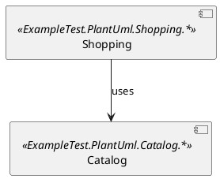

# ArchUnitNET - Sample Synthesis

**Generated**: 2026-02-05
**Version**: v1
**Project ID**: project-0002

---

## Overview

This synthesis maps patterns, vocabulary, and capabilities observed in ArchUnitNET samples. It is **descriptive, not prescriptive**. Multiple approaches are documented without preference. Tensions between approaches are noted without resolution.

| Metric | Count |
|--------|-------|
| Samples Analyzed | 5 |
| Sequences Analyzed | 0 (Tier 2 skipped) |
| Domains Analyzed | 6 |
| Patterns Documented | 31 |
| Tensions Identified | 20 |

---

## Document Sections

| Section | Purpose | Jump To |
|---------|---------|---------|
| Vocabulary | Core types, methods, domain terms | [Vocabulary](#vocabulary-reference) |
| Patterns | Implementation patterns with code | [Patterns](#pattern-catalog) |
| Sequences | Learning progressions | [Sequences](#sequence-progressions) |
| Tensions | Design choices and alternatives | [Tensions](#tensions-and-design-choices) |
| Dependencies | Package requirements | [Dependencies](#dependency-landscape) |
| Coverage | Gaps, methodology, sample index | [Coverage](#coverage-and-methodology) |

---

## Quick Reference

### Most Common Patterns
1. **Static Architecture Initialization** — `new ArchLoader().LoadAssemblies().Build()` as static field
2. **Fluent Rule Definition** — `Types().That().Should()` method chaining
3. **xUnit Integration** — `[Fact]` attribute with `Check()` or `Assert.*` execution

### Key Tensions (Unresolved)
1. **Fluent API vs Programmatic Querying** — Declarative rules vs explicit LINQ control
2. **Throwing vs Non-Throwing Execution** — `Check()` exceptions vs `HasNoViolations()` boolean
3. **Type-Level vs Member-Level Analysis** — `Class`/`IArchRule` vs `IType.Members`

### Required Dependencies
- `ArchUnitNET.Loader` — Architecture loading
- `ArchUnitNET.Domain` — Core types (Architecture, Class, Interface, IType)
- `ArchUnitNET.Fluent` — Rule definition API
- `xUnit` — Test framework integration

---

## Usage Notes

**This synthesis can be used for:**
- LLM context when working with ArchUnitNET
- Onboarding new contributors
- API design reference
- Documentation source material

**This synthesis should NOT be used as:**
- Prescriptive guidance on "the right way"
- Architectural recommendations
- A replacement for official documentation

---

# Vocabulary Reference

## Core Types

| Type | Namespace | First Observed | Purpose (as demonstrated) |
|------|-----------|----------------|---------------------------|
| Architecture | ArchUnitNET.Domain | ExampleArchUnitTest | Container for loaded assembly architecture; entry point for all queries |
| ArchLoader | ArchUnitNET.Loader | ExampleArchUnitTest | Fluent builder for loading assemblies into architecture model |
| IObjectProvider\<T\> | ArchUnitNET.Fluent | ExampleArchUnitTest | Fluent selector for architecture elements (types, classes, interfaces) |
| IArchRule | ArchUnitNET.Fluent | ExampleArchUnitTest | Represents an executable architecture rule with Check()/HasNoViolations() |
| Class | ArchUnitNET.Domain | ExampleArchUnitTestCooking | Represents a class type; used in fluent API and LINQ queries |
| Interface | ArchUnitNET.Domain | ExampleArchUnitTestCooking | Represents an interface type in the architecture model |
| IType | ArchUnitNET.Domain | LimitationsOnReleaseTest | Lower-level type representation with Members collection access |

---

## Core Methods/Operations

### Architecture Loading

| Method | On Type | Purpose |
|--------|---------|---------|
| `LoadAssemblies()` | ArchLoader | Loads one or more assemblies into the loader |
| `LoadNamespacesWithinAssembly()` | ArchLoader | Loads specific namespaces within an assembly (scoped loading) |
| `Build()` | ArchLoader | Finalizes loading and returns Architecture instance |

### Fluent Selectors

| Method | On Type | Purpose |
|--------|---------|---------|
| `Types()` | ArchRuleDefinition | Entry point for selecting all types |
| `Classes()` | ArchRuleDefinition | Entry point for selecting classes |
| `Interfaces()` | ArchRuleDefinition | Entry point for selecting interfaces |
| `MethodMembers()` | ArchRuleDefinition | Entry point for selecting method members |
| `Slices()` | SliceRuleDefinition | Entry point for slice-based module rules |

### Fluent Conditions (`.That()` chain)

| Method | Purpose |
|--------|---------|
| `That()` | Begins fluent condition chain for filtering |
| `ResideInAssembly()` | Filters types by assembly name |
| `ResideInNamespace()` | Filters types by namespace string |
| `ImplementInterface()` | Filters classes by implemented interface |
| `HaveFullNameContaining()` | Filters by full name string match |
| `AreAssignableTo()` | Filters types by assignability |
| `AreDeclaredIn()` | Filters method members by declaring type |
| `DoNotHaveAnyAttributes()` | Filters classes lacking specified attribute |
| `Are()` | Filters types by exact System.Type match |
| `HaveName()` | Filters methods by exact name string |
| `Or()` | Combines conditions with logical OR |

### Fluent Assertions (`.Should()` chain)

| Method | Purpose |
|--------|---------|
| `Should()` | Begins fluent assertion chain for rules |
| `NotDependOnAny()` | Assert types do not depend on specified types |
| `NotExist()` | Assert selected types do not exist |
| `HaveNameContaining()` | Assert types have names containing string |
| `NotCallAny()` | Assert types do not call specified methods |
| `CallAny()` | Assert types call any of specified methods |
| `AdhereToPlantUmlDiagram()` | Assert architecture matches PlantUML diagram |
| `BeFreeOfCycles()` | Assert slices have no cyclic dependencies |

### Rule Execution & Metadata

| Method | On Type | Purpose |
|--------|---------|---------|
| `As()` | IObjectProvider | Assigns custom description to object provider |
| `Because()` | IArchRule | Attaches custom reason to architecture rule |
| `Check()` | IArchRule | Executes rule; throws exception on violation |
| `HasNoViolations()` | IArchRule | Returns boolean indicating rule passes |
| `And()` | IArchRule | Combines rules with logical AND |
| `WithoutRequiringPositiveResults()` | IArchRule | Exempts rule from requiring matched types |
| `Matching()` | Slice selector | Selects slices using namespace pattern with capture groups |

### Extension Methods (ArchUnitNET.Domain.Extensions)

| Method | On Type | Returns | Purpose |
|--------|---------|---------|---------|
| `NameEndsWith()` | Class | bool | Filter by name suffix |
| `GetInterfaceOfType()` | Architecture | Interface | Convert System.Type to Interface |
| `ImplementsInterface()` | Class | bool | Check interface implementation |
| `GetClassOfType()` | Architecture | IType | Convert System.Type to IType |
| `GetTypeDependencies()` | IMember | IEnumerable\<IType\> | Get member dependencies |

### Properties

| Property | On Type | Returns | Purpose |
|----------|---------|---------|---------|
| `Classes` | Architecture | IEnumerable\<Class\> | All classes in loaded architecture |
| `Members` | IType | Collection | All members (methods, fields) of a type |
| `FullName` | IMember | string | Fully qualified member name |

---

## Domain-Specific Terms

| Term | Meaning |
|------|---------|
| Layer | Logical grouping of types (e.g., by assembly or namespace) |
| Architecture Rule | Testable constraint on code structure (dependencies, naming, etc.) |
| Object Provider | Fluent selector that filters architecture elements |
| Violation | Instance where code fails to satisfy an architecture rule |
| Rule Composition | Combining multiple rules into single rule via And() |
| Positive Results | Requirement that rule selector matches at least one element |
| Slice | Partition of architecture based on namespace patterns (module-level) |
| Cycle | Circular dependency between slices or components |

---

## Type Relationships

### Abstraction Hierarchy
- `IType` → base abstraction (has Members)
  - `Class` → concrete class (used in fluent API)
  - `Interface` → interface type

### Rule System
- `IArchRule` — executable rule object
  - Created by fluent API (`Types().That().Should()...`)
  - Executed via `Check()` or `HasNoViolations()`
  - Composed via `And()`

### Collection Access
- `Architecture.Classes` → `IEnumerable<Class>` (type-level)
- `IType.Members` → member collection (member-level)
- `IMember.GetTypeDependencies()` → `IEnumerable<IType>` (dependency-level)

---

# Pattern Catalog

## Pattern Summary

| Pattern | Category | Frequency | Key Samples |
|---------|----------|-----------|-------------|
| Static Architecture Initialization | Architecture Rule | 5/5 | All samples |
| Fluent Object Provider Declaration | Architecture Rule | 2/5 | ExampleArchUnitTest, WebsiteDocumentationTest |
| Rule Execution with Check() | Architecture Rule | 4/5 | ExampleArchUnitTest, LimitationsOnReleaseTest, Puml, WebsiteDoc (commented) |
| Non-Throwing Rule Evaluation | Architecture Rule | 3/5 | ExampleArchUnitTest, WebsiteDocumentationTest |
| Constructor-Based Initialization | Test Organization | 1/5 | ExampleArchUnitTestCooking |
| Direct Architecture Querying | Programmatic Querying | 2/5 | Cooking, Limitations |
| PlantUML Diagram Validation | PlantUML Integration | 1/5 | ExampleArchUnitTestPuml |
| Negative Testing (Assert.False) | Meta-Testing | 1/5 | WebsiteDocumentationTest |
| Member-Level Dependency Querying | Edge Case Testing | 1/5 | LimitationsOnReleaseTest |

---

## Architecture Rule Patterns

### Pattern: Static Architecture Initialization

**Category**: Architecture Rule
**Observed In**: All 5 samples
**Frequency**: Universal

#### Mechanism

Architecture is loaded once as a static readonly field at class initialization time using ArchLoader fluent API.

#### Code Signature

```csharp
private static readonly Architecture Architecture =
    new ArchLoader()
        .LoadAssemblies(typeof(SomeClass).Assembly)
        .Build();
```

#### Assumptions
- Assembly to test is available via `System.Reflection.Assembly.Load()`
- Architecture does not change during test execution
- Static initialization optimizes test performance (load once, run many tests)

#### Variations

| Variation | Samples | Difference |
|-----------|---------|------------|
| Full assembly loading | ExampleArchUnitTest, Cooking, Limitations | `LoadAssemblies()` loads entire assembly |
| Namespace-scoped loading | ExampleArchUnitTestPuml | `LoadNamespacesWithinAssembly()` loads specific namespace subtree |

---

### Pattern: Fluent Object Provider Declaration

**Category**: Architecture Rule
**Observed In**: ExampleArchUnitTest
**Frequency**: 1 sample (explicit); implicit in others

#### Mechanism

Object providers (layers, class groups) are declared as readonly instance fields using fluent API, terminated with `.As()` for custom descriptions.

#### Code Signature

```csharp
private readonly IObjectProvider<IType> ExampleLayer =
    Types()
        .That()
        .ResideInAssembly("ExampleAssembly")
        .And()
        .ResideInNamespace("ExampleNamespace")
        .As("Example Layer");
```

#### Assumptions
- Object providers are reusable across multiple test methods
- Descriptions aid in failure diagnostics
- Instance fields allow different test instances to share architecture but have own providers

---

### Pattern: Inline Rule Definition

**Category**: Architecture Rule
**Observed In**: ExampleArchUnitTest, WebsiteDocumentationTest
**Frequency**: 2 samples

#### Mechanism

Rules are defined inline within test methods as local variables using fluent API.

#### Code Signature

```csharp
[Fact]
public void TypesShouldNotDependOnForbiddenLayer()
{
    IArchRule rule = Types()
        .That()
        .Are(ExampleLayer)
        .Should()
        .NotDependOnAny(ForbiddenLayer)
        .Because("forbidden layer should not be referenced");
    
    rule.Check(Architecture);
}
```

#### Assumptions
- Rules are specific to single test method
- Fluent API provides sufficient expressiveness
- `Because()` provides context in failure messages

---

### Pattern: Rule Composition via And()

**Category**: Architecture Rule
**Observed In**: ExampleArchUnitTest
**Frequency**: 1 sample

#### Mechanism

Multiple IArchRule instances combined into single rule using `.And()` method.

#### Code Signature

```csharp
IArchRule combinedRule = ruleOne.And(ruleTwo);
combinedRule.Check(Architecture);
```

#### Assumptions
- All constituent rules apply to same architecture
- Combined check provides aggregate result

---

### Pattern: Rule Execution with Check()

**Category**: Architecture Rule
**Observed In**: ExampleArchUnitTest, LimitationsOnReleaseTest, ExampleArchUnitTestPuml
**Frequency**: 3 samples (active), 1 sample (commented)

#### Mechanism

`IArchRule.Check(Architecture)` executes rule against architecture, throws exception on violations.

#### Code Signature

```csharp
rule.Check(Architecture);  // Throws FailedArchRuleException on violation
```

#### Assumptions
- Test framework (xUnit) will fail test on exception
- Violation details included in exception message
- Immediate failure on first violation

---

### Pattern: Non-Throwing Rule Evaluation

**Category**: Architecture Rule
**Observed In**: ExampleArchUnitTest, WebsiteDocumentationTest
**Frequency**: 2 samples

#### Mechanism

`IArchRule.HasNoViolations(Architecture)` returns boolean without throwing, enabling programmatic rule checks.

#### Code Signature

```csharp
bool passes = rule.HasNoViolations(Architecture);
Assert.True(passes);  // Standard assertion

// Or for meta-testing (verify violations ARE found):
Assert.False(rule.HasNoViolations(Architecture));
```

#### Assumptions
- Test author wants explicit control over assertion logic
- Enables negative testing (testing FOR violations)
- No exception thrown regardless of result

---

### Pattern: Negative Existence Testing

**Category**: Architecture Rule
**Observed In**: ExampleArchUnitTest
**Frequency**: 1 sample

#### Mechanism

Three approaches to testing non-existent types:
1. Default: Fails when no types match selector (catches typos)
2. `NotExist()`: Passes when asserting absence
3. `WithoutRequiringPositiveResults()`: Passes with zero matches

#### Code Signature

```csharp
// Approach 1: Default - fails if selector matches nothing
var rule = Types().That().HaveFullNameContaining("Typo").Should()...;
// This will fail because "Typo" doesn't match

// Approach 2: Explicit non-existence assertion
var rule = Types().That().HaveFullNameContaining("Forbidden").Should().NotExist();

// Approach 3: Exempt from positive results requirement
var rule = Types().That()...Should()...WithoutRequiringPositiveResults();
```

---

### Pattern: Layer Dependency Rules

**Category**: Architecture Rule
**Observed In**: ExampleArchUnitTest
**Frequency**: 1 sample

#### Mechanism

Rules express layer constraints using `NotDependOnAny()` to prohibit dependencies between layers.

#### Code Signature

```csharp
IArchRule rule = Types()
    .That()
    .Are(ExampleLayer)
    .Should()
    .NotDependOnAny(ForbiddenLayer);
```

---

### Pattern: Naming Convention Rules

**Category**: Architecture Rule
**Observed In**: ExampleArchUnitTest
**Frequency**: 1 sample

#### Mechanism

Rules enforce naming conventions using `HaveNameContaining()`.

#### Code Signature

```csharp
IArchRule rule = Classes()
    .That()
    .ImplementInterface(typeof(IService))
    .Should()
    .HaveNameContaining("Service");
```

---

### Pattern: Method Call Rules

**Category**: Architecture Rule
**Observed In**: ExampleArchUnitTest, LimitationsOnReleaseTest
**Frequency**: 2 samples

#### Mechanism

Rules constrain method calls using `NotCallAny()` or `CallAny()` with `MethodMembers()` selector.

#### Code Signature

```csharp
// Prohibit calls
IArchRule rule = Classes()
    .That()
    .Are(ProductionLayer)
    .Should()
    .NotCallAny(
        MethodMembers()
            .That()
            .AreDeclaredIn(ForbiddenLayer)
            .Or()
            .HaveNameContaining("forbidden")
    );

// Assert calls exist
IArchRule rule = Classes()
    .That()
    .Are(typeof(AsyncUser))
    .Should()
    .CallAny(MethodMembers().That().HaveName("MethodAsync()"));
```

---

## Test Organization Patterns

### Pattern: Constructor-Based Test Variable Initialization

**Category**: Test Organization
**Observed In**: ExampleArchUnitTestCooking
**Frequency**: 1 sample

#### Mechanism

Test variables initialized in class constructor by querying static Architecture instance.

#### Code Signature

```csharp
public class ExampleArchUnitTestCooking
{
    private static readonly Architecture Architecture = ...;
    
    private readonly IEnumerable<Class> _chefs;
    private readonly Interface _cook;
    
    public ExampleArchUnitTestCooking()
    {
        _chefs = Architecture.Classes.Where(c => c.NameEndsWith("Chef"));
        _cook = Architecture.GetInterfaceOfType(typeof(ICook));
    }
}
```

#### Assumptions
- xUnit creates new instance per test method
- Constructor runs after static Architecture is loaded
- Alternative to static providers

---

### Pattern: Inline Test Fixture Classes

**Category**: Test Organization
**Observed In**: ExampleArchUnitTestCooking, LimitationsOnReleaseTest
**Frequency**: 2 samples

#### Mechanism

Test fixture classes defined at end of test file, loaded via `typeof().Assembly`.

#### Code Signature

```csharp
public class MyArchitectureTest
{
    private static readonly Architecture Architecture =
        new ArchLoader()
            .LoadAssemblies(typeof(FrenchChef).Assembly)
            .Build();
    
    // ... tests ...
}

// Test fixtures at end of file
internal class FrenchChef : ICook { }
internal class ItalianChef : ICook { }
internal interface ICook { }
```

---

## Programmatic Querying Patterns

### Pattern: Direct Architecture Querying via Collections

**Category**: Programmatic Querying
**Observed In**: ExampleArchUnitTestCooking
**Frequency**: 1 sample

#### Mechanism

Architecture exposes `.Classes` collection queryable via LINQ with extension methods.

#### Code Signature

```csharp
var chefs = Architecture.Classes
    .Where(c => c.NameEndsWith("Chef"))
    .ToList();

var cook = Architecture.GetInterfaceOfType(typeof(ICook));

Assert.All(chefs, c => Assert.True(c.ImplementsInterface(cook)));
```

#### Assumptions
- Developer prefers explicit LINQ over fluent rule API
- Extension methods provide necessary filtering primitives
- xUnit Assert methods provide sufficient assertion expressiveness

---

### Pattern: Member-Level Dependency Querying

**Category**: Programmatic Querying
**Observed In**: LimitationsOnReleaseTest
**Frequency**: 1 sample

#### Mechanism

Access `IType.Members` collection for finer-grained dependency analysis than type-level API.

#### Code Signature

```csharp
private static readonly IType EdgeCaseDataType = 
    Architecture.GetClassOfType(typeof(EdgeCaseData));

[Fact]
public void TypeOfDependencyIsDetected()
{
    var method = EdgeCaseDataType.Members
        .First(m => m.FullName.Contains(nameof(EdgeCaseData.TypeOf)));
    
    var dependencies = method.GetTypeDependencies();
    
    Assert.Contains(DependencyTarget, dependencies);
}
```

#### Assumptions
- Member-level granularity required (not achievable with fluent API)
- `GetTypeDependencies()` returns comprehensive dependency list
- Static IType fields provide reusable type references

---

### Pattern: Hybrid Query Style (Programmatic + Fluent)

**Category**: Programmatic Querying
**Observed In**: LimitationsOnReleaseTest
**Frequency**: 1 sample

#### Mechanism

Single test class mixes programmatic LINQ for edge case verification with fluent API for standard rules.

#### Code Signature

```csharp
public class LimitationsOnReleaseTest
{
    // Programmatic: member-level edge case verification
    [Fact]
    public void TypeOfDependencyIsDetected()
    {
        var method = EdgeCaseDataType.Members.First(...);
        Assert.Contains(DependencyTarget, method.GetTypeDependencies());
    }
    
    // Fluent: standard rule assertion
    [Fact]
    public void AsyncMethodCallIsDetected()
    {
        Classes().That().Are(typeof(AsyncUser))
            .Should().CallAny(MethodMembers().That().HaveName("MethodAsync()"))
            .Check(Architecture);
    }
}
```

---

## PlantUML Integration Patterns

### Pattern: Namespace-Scoped Architecture Loading

**Category**: PlantUML Integration
**Observed In**: ExampleArchUnitTestPuml
**Frequency**: 1 sample

#### Mechanism

Load only types within specified namespace subtree.

#### Code Signature

```csharp
private static readonly Architecture Architecture =
    new ArchLoader()
        .LoadNamespacesWithinAssembly(
            typeof(SomeClass).Assembly,
            "ExampleTest.PlantUml")
        .Build();
```

---

### Pattern: PlantUML Diagram-Based Architecture Validation

**Category**: PlantUML Integration
**Observed In**: ExampleArchUnitTestPuml
**Frequency**: 1 sample

#### Mechanism

`AdhereToPlantUmlDiagram()` reads PlantUML component diagram, maps stereotypes to namespaces, validates dependencies.

#### Code Signature

```csharp
[Fact]
public void ArchitectureShouldMatchDiagram()
{
    Types()
        .Should()
        .AdhereToPlantUmlDiagram("shopping_example.puml")
        .Check(Architecture);
}
```

#### PlantUML Diagram Format



---

### Pattern: Diagram-as-Documentation-and-Test

**Category**: PlantUML Integration
**Observed In**: ExampleArchUnitTestPuml
**Frequency**: 1 sample

#### Mechanism

Single PlantUML diagram serves dual purpose: visual documentation (renderable) and executable specification (validated by test).

#### Assumptions
- Diagram is maintained alongside code
- Divergence between diagram and code causes test failure
- Non-developers can review/modify architecture rules via diagram

---

## Slice-Based Rule Patterns

### Pattern: Slice-Based Cycle Detection

**Category**: Slice-Based Rules
**Observed In**: WebsiteDocumentationTest
**Frequency**: 1 sample

#### Mechanism

`Slices().Matching()` creates slices from namespace pattern with capture group; `BeFreeOfCycles()` detects circular dependencies.

#### Code Signature

```csharp
using static ArchUnitNET.Fluent.Slices.SliceRuleDefinition;

[Fact]
public void ModulesShouldBeFreeOfCycles()
{
    var rule = Slices()
        .Matching("Module.(*)")
        .Should()
        .BeFreeOfCycles();
    
    Assert.False(rule.HasNoViolations(Architecture));  // Meta-test: expects cycles
}
```

#### Assumptions
- Namespace patterns with capture groups define slice boundaries
- Pattern `"Module.(*)"` creates slices named "One", "Two", "Three" from `Module.One.*`, `Module.Two.*`, `Module.Three.*`
- Transitive dependency analysis performed (A→B→C→A detected)

---

## Meta-Testing Patterns

### Pattern: Negative Testing (Assert.False with HasNoViolations)

**Category**: Meta-Testing
**Observed In**: WebsiteDocumentationTest
**Frequency**: 1 sample

#### Mechanism

Test fixtures contain deliberate violations; `Assert.False(rule.HasNoViolations())` verifies framework detects them.

#### Code Signature

```csharp
[Fact]
public void ModelShouldNotDependOnView_DocumentsDetection()
{
    IArchRule rule = Classes()
        .That()
        .ResideInNamespace("Model")
        .Should()
        .NotDependOnAny(Classes().That().ResideInNamespace("View"));
    
    // Assert violations ARE found (semantic inversion)
    Assert.False(rule.HasNoViolations(Architecture));
    
    // Check() commented out - would throw exception
    // rule.Check(Architecture);
}
```

#### Assumptions
- Test should pass when violations are found
- Documentation tests should not fail builds via exceptions
- Validates framework correctly identifies violations

---

## Edge Case Testing Patterns

### Pattern: Edge Case Dependency Detection

**Category**: Edge Case Testing
**Observed In**: LimitationsOnReleaseTest
**Frequency**: 1 sample

#### Mechanism

Test fixtures demonstrate implicit dependencies; tests verify framework CAN detect them.

#### Edge Cases Documented

| Edge Case | C# Construct | Detection |
|-----------|--------------|-----------|
| typeof() operator | `var t = typeof(DependencyTarget);` | ✅ Detected |
| Cast expression | `_ = (DependencyTarget)null;` | ✅ Detected |
| Null variable declaration | `DependencyTarget d = null;` | ✅ Detected |
| Async method call | `await asyncService.MethodAsync();` | ✅ Detected |

#### Code Signature

```csharp
internal class EdgeCaseData
{
    public void TypeOf()
    {
        var t = typeof(DependencyTarget);  // Creates dependency
    }
    
    public void Cast()
    {
        _ = (DependencyTarget)null;  // Creates dependency
    }
    
    public void NullDeclaration()
    {
        #pragma warning disable 219
        DependencyTarget d = null;  // Creates dependency
        #pragma warning restore 219
    }
}
```

---

# Sequence Progressions

**Note**: Tier 2 (Sequence Analysis) was skipped for this project. The samples were analyzed individually (Tier 1) and by capability domain (Tier 3), not as pedagogical sequences.

## Potential Sequences (Not Analyzed)

Based on sample complexity, a natural learning progression might be:

| Suggested Order | Sample | Complexity | Would Introduce |
|-----------------|--------|------------|-----------------|
| 1 | ExampleArchUnitTest | Basic | Core fluent API, Check()/HasNoViolations(), layer rules |
| 2 | ExampleArchUnitTestCooking | Basic | Programmatic alternative, LINQ querying, extension methods |
| 3 | ExampleArchUnitTestPuml | Intermediate | External diagrams, PlantUML integration |
| 4 | WebsiteDocumentationTest | Advanced | Meta-testing, slice rules, Assert.False pattern |
| 5 | LimitationsOnReleaseTest | Advanced | Member-level access, edge cases, hybrid style |

**Not analyzed**: Formal sequence analysis would identify vocabulary progression, pattern introduction order, and conceptual dependencies between samples.

---

# Tensions and Design Choices

This section documents tensions observed across samples. These are explicitly **NOT resolved** — they represent design choices for implementers.

## Tension Summary

| # | Tension | Domain | Approaches |
|---|---------|--------|------------|
| 1 | Fluent API vs Programmatic Querying | ArchitectureRules | Declarative rules vs LINQ control |
| 2 | Throwing vs Non-Throwing Execution | ArchitectureRules | Check() vs HasNoViolations() |
| 3 | Inline vs External Rule Definition | ArchitectureRules | Code rules vs PlantUML diagrams |
| 4 | Empty Result Set Handling | ArchitectureRules | Default fail vs NotExist() vs WithoutRequiringPositiveResults() |
| 5 | Assert.False vs Assert.True/Check() | MetaTesting | Verify violations found vs verify no violations |
| 6 | Commented Check() vs Active Check() | MetaTesting | Documentation mode vs enforcement mode |
| 7 | Intentional Violations vs Edge Case Detection | MetaTesting | Document rules vs verify detection |
| 8 | Static Providers vs Constructor Initialization | TestOrganization | Shared vs per-instance variables |
| 9 | Full Assembly vs Namespace-Scoped Loading | TestOrganization | Load all vs load subset |
| 10 | Inline Fixtures vs Separate Data File | TestOrganization | Self-contained vs separated |
| 11 | Programmatic Member Querying vs Fluent API | EdgeCaseTesting | IType.Members vs Classes().Should() |
| 12 | IType vs Class Selection | EdgeCaseTesting | Member access vs fluent rules |
| 13 | Assert.Contains vs Check() | EdgeCaseTesting | xUnit assertion vs rule exception |
| 14 | Slice-Level vs Type-Level Analysis | SliceRules | Module granularity vs type granularity |
| 15 | Pattern Syntax vs Fluent Conditions | SliceRules | String patterns vs method chains |
| 16 | Slice Rule Evaluation Mode | SliceRules | Only HasNoViolations() demonstrated |
| 17 | Class vs IType Selection | ProgrammaticQuerying | Type-level vs member-level access |
| 18 | Constructor vs Static Initialization | ProgrammaticQuerying | Fresh state vs shared state |
| 19 | Pure Programmatic vs Hybrid Style | ProgrammaticQuerying | Consistent vs mixed approaches |
| 20 | Programmatic vs Fluent API | ProgrammaticQuerying | Explicit LINQ vs declarative rules |

---

## Tension Details

### Tension 1: Fluent API vs Programmatic Querying

**Domain**: ArchitectureRules
**Manifestation**: ExampleArchUnitTest uses fluent API; ExampleArchUnitTestCooking uses LINQ

#### Approach A: Fluent Rule API

- **Observed in**: ExampleArchUnitTest, WebsiteDocumentationTest, Puml
- **Assumes**: Declarative rule definition is preferable; rules are reusable objects
- **Mechanism**: `Types().That().Should()...` → `IArchRule` → `Check()`

```csharp
IArchRule rule = Classes()
    .That()
    .ImplementInterface(typeof(IService))
    .Should()
    .HaveNameContaining("Service");
rule.Check(Architecture);
```

#### Approach B: Programmatic LINQ Querying

- **Observed in**: ExampleArchUnitTestCooking, LimitationsOnReleaseTest
- **Assumes**: Explicit LINQ control is preferable; direct xUnit assertions
- **Mechanism**: `Architecture.Classes.Where()...` → LINQ → `Assert.*`

```csharp
var services = Architecture.Classes
    .Where(c => c.ImplementsInterface(serviceInterface))
    .ToList();
Assert.All(services, s => Assert.True(s.NameEndsWith("Service")));
```

#### Nature of Tension

Cannot mix `IArchRule.Check()` with raw LINQ results (different return types). Fluent provides `Because()` for error context; programmatic provides full LINQ expressiveness.

**Resolution**: Not provided — design choice for implementer.

---

### Tension 2: Throwing vs Non-Throwing Execution

**Domain**: ArchitectureRules
**Manifestation**: Same rule can be executed two ways

#### Approach A: Check() — Throwing

- **Observed in**: ExampleArchUnitTest, LimitationsOnReleaseTest, Puml
- **Assumes**: First violation should fail test immediately
- **Mechanism**: Throws `FailedArchRuleException` on violation

```csharp
rule.Check(Architecture);  // Throws on violation
```

#### Approach B: HasNoViolations() — Non-Throwing

- **Observed in**: ExampleArchUnitTest, WebsiteDocumentationTest
- **Assumes**: Caller wants control over assertion logic
- **Mechanism**: Returns boolean, enables negative testing

```csharp
bool passes = rule.HasNoViolations(Architecture);
Assert.True(passes);  // Or Assert.False() for meta-testing
```

#### Nature of Tension

Cannot achieve negative testing (testing FOR violations) with `Check()`. `HasNoViolations()` enables `Assert.False()` pattern.

**Resolution**: Not provided — design choice based on test purpose.

---

### Tension 3: Inline vs External Rule Definition

**Domain**: ArchitectureRules
**Manifestation**: ExampleArchUnitTest vs ExampleArchUnitTestPuml

#### Approach A: Inline Code Rules

- **Observed in**: ExampleArchUnitTest, Cooking, WebsiteDoc, Limitations
- **Assumes**: Rules close to tests; developers maintain rules; type-safe
- **Mechanism**: Fluent API or LINQ in test code

#### Approach B: External PlantUML Diagrams

- **Observed in**: ExampleArchUnitTestPuml
- **Assumes**: Rules externalized for non-developer review; diagram is documentation
- **Mechanism**: `AdhereToPlantUmlDiagram("file.puml")`

#### Nature of Tension

Cannot partially externalize — PlantUML or inline, not both for same rule. Diagram enables non-developer review but loses type safety.

**Resolution**: Not provided — design choice based on audience.

---

### Tension 4: Empty Result Set Handling

**Domain**: ArchitectureRules
**Manifestation**: Three distinct strategies in ExampleArchUnitTest

#### Approach A: Default — Fail on Empty

- **Assumes**: Empty results indicate rule misconfiguration (catches typos)

#### Approach B: NotExist()

- **Assumes**: Explicitly testing that something doesn't exist

#### Approach C: WithoutRequiringPositiveResults()

- **Assumes**: Rule should pass even with zero matches

#### Nature of Tension

Same empty result can be success or failure depending on intent.

**Resolution**: Not provided — choose based on what empty results mean.

---

### Tension 11: Programmatic Member Querying vs Fluent API

**Domain**: EdgeCaseTesting
**Manifestation**: LimitationsOnReleaseTest uses both in same class

#### Approach A: Programmatic (Member-Level)

- **Assumes**: Member-level granularity required
- **Mechanism**: `IType.Members` + LINQ + `GetTypeDependencies()`

```csharp
var method = EdgeCaseDataType.Members.First(m => m.FullName.Contains("TypeOf"));
Assert.Contains(DependencyTarget, method.GetTypeDependencies());
```

#### Approach B: Fluent API (Type-Level)

- **Assumes**: Type-level analysis sufficient
- **Mechanism**: `Classes().That().Should()` operates at type level only

```csharp
Classes().That().Are(typeof(AsyncUser))
    .Should().CallAny(MethodMembers().That().HaveName("MethodAsync()"))
    .Check(Architecture);
```

#### Nature of Tension

Fluent API cannot access `IType.Members`. Programmatic required for member-level dependency inspection.

**Resolution**: Not provided — use programmatic when member access needed.

---

### Tension 14: Slice-Level vs Type-Level Analysis

**Domain**: SliceRules
**Manifestation**: WebsiteDocumentationTest uses slice rules; others use type rules

#### Approach A: Type-Level Rules

- **Assumes**: Individual type relationships matter
- **Mechanism**: `Classes().That().Should().NotDependOnAny()`

#### Approach B: Slice-Level Rules

- **Assumes**: Module boundaries matter more than individual types
- **Mechanism**: `Slices().Matching("Module.(*)").Should().BeFreeOfCycles()`

#### Nature of Tension

Different architectural concerns require different granularity. Slice rules aggregate; type rules detail.

**Resolution**: Not provided — choose based on architectural concern.

---

### Tension 20: Programmatic vs Fluent API (Fundamental)

**Domain**: Cross-cutting
**Manifestation**: Different samples choose different approaches

#### Approach A: Fluent Rule API

- **Strengths**: Declarative, reusable `IArchRule` objects, `Because()` for error context
- **Weakness**: No member-level access, fixed expressiveness

#### Approach B: Programmatic LINQ

- **Strengths**: Full LINQ power, member-level access, arbitrary complexity
- **Weakness**: No `IArchRule` objects, manual error messages

#### Nature of Tension

Same architectural tests can be written either way with different ergonomics. LimitationsOnReleaseTest shows hybrid is valid.

**Resolution**: Not provided — fundamental design choice between explicit control and declarative abstraction.

---

# Dependency Landscape

## Required Dependencies (Universal)

These packages are required for all ArchUnitNET usage:

| Package | Namespace | Purpose |
|---------|-----------|---------|
| ArchUnitNET.Loader | ArchUnitNET.Loader | Load assemblies into Architecture model |
| ArchUnitNET.Domain | ArchUnitNET.Domain | Core types: Architecture, Class, Interface, IType |
| xUnit | Xunit | Test framework integration |

---

## Conditional Dependencies (Per Capability)

| Capability | Package/Namespace | When Needed |
|------------|-------------------|-------------|
| Fluent Rule API | ArchUnitNET.Fluent | When using `Types().That().Should()` fluent syntax |
| Programmatic Querying | ArchUnitNET.Domain.Extensions | When using extension methods (NameEndsWith, GetClassOfType, etc.) |
| Programmatic Querying | System.Linq | When using LINQ on Architecture collections |
| PlantUML Integration | ArchUnitNET.Fluent | When using `AdhereToPlantUmlDiagram()` |
| Slice-Based Rules | ArchUnitNET.Fluent.Slices | When using `Slices().Matching()` |
| xUnit Integration | ArchUnitNET.xUnit (optional) | For enhanced xUnit integration |

---

## Capability Domain Summary

| Domain | Patterns | Samples | Key Tensions |
|--------|----------|---------|--------------|
| ArchitectureRules | 11 | 5 | Fluent vs Programmatic, Check() vs HasNoViolations() |
| TestOrganization | 6 | 5 | Static vs Constructor init, Full vs Scoped loading |
| ProgrammaticQuerying | 4 | 2 | Class vs IType, Pure vs Hybrid style |
| MetaTesting | 3 | 2 | Assert.False pattern, Commented Check() |
| EdgeCaseTesting | 3 | 1 | Member-level querying, IType vs Class |
| SliceRules | 1 | 1 | Slice vs Type abstraction, Pattern syntax |
| PlantUMLIntegration | 5 | 1 | External vs Inline rules |

---

## Static Import Patterns

Different capabilities require different static imports:

```csharp
// Fluent Rule API
using static ArchUnitNET.Fluent.ArchRuleDefinition;

// Slice Rules
using static ArchUnitNET.Fluent.Slices.SliceRuleDefinition;

// Extension Methods
using ArchUnitNET.Domain.Extensions;
```

---

# Coverage and Methodology

## Gaps and Limitations

### Not Demonstrated in Samples

- **xUnit `IClassFixture` or `ICollectionFixture`** — Alternative to static fields for shared state
- **Async test methods** — All tests are synchronous
- **Theory/InlineData patterns** — All tests are individual `[Fact]` methods
- **Test ordering or dependencies** — Tests appear independent
- **Multiple assemblies under test** — All samples test single assembly
- **Framework limitations** — No samples show what ArchUnitNET CANNOT detect
- **Alternative test frameworks** — Only xUnit demonstrated (NUnit, MSTest not shown)

### Partial Coverage

- **Slice assertions** — Only `BeFreeOfCycles()` demonstrated; other slice assertions may exist
- **PlantUML features** — Single diagram demonstrated; advanced features not shown
- **Error message customization** — `Because()` shown but not extensively explored

### Assumed Knowledge

- C# language fundamentals
- xUnit testing basics
- LINQ query syntax
- Namespace and assembly concepts
- Static vs instance member semantics

---

## Sample Index

| Sample | Path | Tier 1 | Domains |
|--------|------|--------|---------|
| ExampleArchUnitTest | ExampleTest/ExampleArchUnitTest.cs | ✅ | ArchitectureRules, TestOrganization |
| ExampleArchUnitTestCooking | ExampleTest/ExampleArchUnitTestCooking.cs | ✅ | ProgrammaticQuerying, TestOrganization |
| ExampleArchUnitTestPuml | ExampleTest/ExampleArchUnitTestPuml.cs | ✅ | ArchitectureRules (PlantUML), TestOrganization |
| WebsiteDocumentationTest | ExampleTest/WebsiteDocumentationTest.cs | ✅ | MetaTesting, SliceRules, TestOrganization |
| LimitationsOnReleaseTest | ExampleTest/LimitationsOnReleaseTest.cs | ✅ | EdgeCaseTesting, ProgrammaticQuerying, TestOrganization |

---

## Methodology

This synthesis was produced using a 4-tier descriptive analysis:

1. **Tier 1 (Single Sample)**: Each sample analyzed independently for vocabulary, patterns, and assumptions
2. **Tier 2 (Sequence Groups)**: *Skipped* — Samples not analyzed as pedagogical progressions
3. **Tier 3 (Capability Domains)**: Cross-cutting capabilities compared across samples
4. **Tier 4 (Cross-Domain)**: Full synthesis with tension identification

**Constraints applied:**
- Descriptive only, not prescriptive
- No recommendations or preferences stated
- Tensions noted without resolution
- All observed approaches documented
- Minority patterns preserved (even if only one sample uses an approach)

---

## Coverage Summary

### Tier 1: Samples Analyzed (5)
1. ExampleArchUnitTest
2. ExampleArchUnitTestCooking
3. ExampleArchUnitTestPuml
4. WebsiteDocumentationTest
5. LimitationsOnReleaseTest

### Tier 2: Sequences Analyzed (0)
- *Skipped* — Went directly from Tier 1 to Tier 3

### Tier 3: Domains Analyzed (6)
1. ArchitectureRules
2. MetaTesting
3. TestOrganization
4. EdgeCaseTesting
5. SliceRules
6. ProgrammaticQuerying

### Known Gaps
- PlantUMLIntegration not analyzed as separate domain (folded into ArchitectureRules)
- Tier 2 sequence analysis not performed
- No samples demonstrating framework limitations

---

## Artifact Locations

| Artifact | Path |
|----------|------|
| This synthesis | `tier-4/v1/ArchUnitNET-Synthesis.md` |
| Session state | `session-state.md` |
| Synthesis findings hub | `synthesis-findings.md` |
| Vocabulary catalog | `vocabulary.md` |
| Patterns catalog | `patterns-catalog.md` |
| Tier 1 analyses | `tier-1/sample-*.md` (5 files) |
| Tier 3 analyses | `tier-3/domain-*.md` (6 files) |

---

## Using This Synthesis

### With Cursor @Docs
Point Cursor's @Docs at this file for semantic retrieval when working with ArchUnitNET code.

### For Onboarding
Use the [Quick Reference](#quick-reference) section for rapid orientation, then explore specific sections as needed.

### For API Reference
Use the [Vocabulary Reference](#vocabulary-reference) section for type and method lookup.

### For Decision Support
Use the [Tensions](#tensions-and-design-choices) section when facing architectural decisions about how to structure tests.

---

**End of Synthesis**
